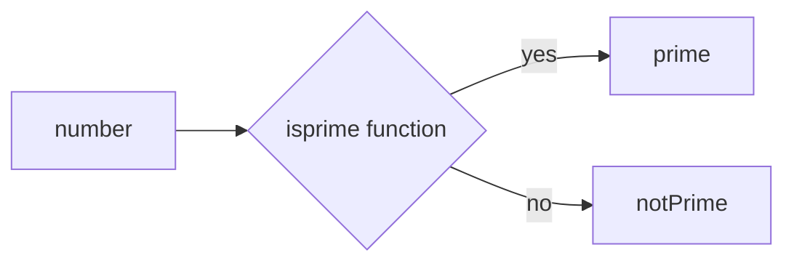

# myFirst-Taban-Project

# this is a very  simple app to recocnize prime numbers in js.

- Project link in [Github](https://github.com/)

## About how its works

just open file with browser input a number and ckick the buttom.

## Equipment was used.

- [x] Equipment was used.
  - [x] Frontend : Html , Css , Js 

## Team 
 - [x] @f.rezaee1991

